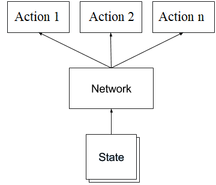

# Reinforcement Learning Project with CartPole

This repository contains fully functional code that can train a policy model to survive in OpenAI Gym's CartPole-v1 environment. To train your own model, run the train.py script; in main, you can choose from 5 different model architectures. To simply run an instance of the CartPole-v1 environment and observe a trained models performance, run the run.py script; in main, you can choose from existing trained models. I would recommend the default, it has performed well in the past. 

Note: To find available model architectures, you can look at the model_architectures.yaml file or the available methods in models.py.
Note: Pretrained models are under the trained_models directory. The naming convention for trained models is Model_Version.Sub-version.Step.

If you have any questions/concerns, don't hesistate to reach out to me at <a href="mailto:mlnasell@uwaterloo.ca">mlnasell@uwaterloo.ca</a> 

## Problem

The goal of this project is develop a policy the CartPole can follow so that it stands. At each time step, OpenAI Gym provides the cart's position, angle, velocity, and angular velocity. It is my job to use this information to determine what action should be taken that will maximize the probability that the CartPole stands. Possible actions are moving left or right. 

## Approach

Reinforcement Learning was used to solve this problem. This concept is similar to that of positive/negative reinforcement in real life: 
    
    If a dog behaves, you give them a treat; if they misbehave, you put them in their cage for a couple minutes. After time, the dog figures out what is considered good/bad behaviour based off of the consequences.
    
This approach can be used to our advantage when training AI. The reinforcement environment consists of four entities:

    1. The environment (OpenAI Gym / Your house)
    2. The agent (CartPole / The dog)
    3. The action space (Move left or right / Behave or misbehave)
    4. The reward (Number / Give treat or put in cage)
    
The approach for solving this problem is the following: train the CartPole to take actions that maximizes it's reward. 

### But how is the network trained?

For a given state, it is the network's job to ouput a vector with probabilities of taking each action in the action space. When training, we attempt to minimize the difference between that output and the action that maximizes rewards. 

For example, if the CartPole is currently travelling to the left, it would be a good idea to reverse that movement and travel right. Thus, a desired output from the model is [0, 1] ([Going left, Going right]). A network without training won't necessarily generate that output. The optimizer's job is to adjust the network so that the vector approaches [0, 1] when the CartPole is moving left.

### So our loss function attempts to minimize that difference. How are rewards used?

We multiply our gradients by the rewards. When performing gradient descent, positive rewards (agent did something right) will cause the optimizer to descend down the vector space. The opposite is true for negative rewards (agent did something bad). This process has the effect of 'learning' what are the appropriate actions to take given a state from the environment.

### The Credit Assignment Problem

There is a fundamental problem with how rewards are calculated: how does the agent know if falling at t = 100 was caused by an action at t = 98 or t = 17? This is known as the 'Credit Assignment Problem'.

To solve this problem, we apply a discount rate to our rewards. For each time step:

    Discounted Reward [t = t] = Reward [t = t] * pow(discount_rate, 0) + ... + Reward [t = t + n] * pow(discount_rate, n)
    
    Note: discount_rate belongs to (0, 1)
    
What does this accomplish? This decreases the impact that future rewards has on current time step. Using discounted rewards, the agent, over many games, is able to 'learn' what actions, given a corresponding input from the environment, are beneficial.

## Model

The tf.keras API was leveraged for the formulation of models. Each model architecture developed consisted of a series or fully-connected layers. Dropout was used for the final design; this design performed the best during testing.

The final design, model_v5, consisted of the following:

    Dense(32) -> Dropout -> Dense(32) -> Dropout -> Dense(32) -> Dropout -> Dense(32) -> Dropout -> Dense(32) -> Dense(2) -> Softmax

## Results

After 5 iterations of the model architecture, a policy model was trained that converged and was able to survive in the environment for virtually unlimited steps. The program was manually stopped at 15,000 steps (about 5 minutes). It took 900 episodes of training to reach this point. Below is a video showing the agents progress throughout the training loop.

A video is available for viewing at <a href = "michaelnasello.ca">michaelnasello.ca<a>

## Acknowledgements

Three resources were used to help me as I learned about Reinforcement Learning:

    1. I was introduced to the idea while completing Jose Portilla's 'Complete Guide to TensorFlow for Deep Learning with Python' course on Udemy: https://www.udemy.com/course/complete-guide-to-tensorflow-for-deep-learning-with-python/
    
    2. Much of the implementation for this project was inspired by the following Medium post: https://medium.com/@hamza.emra/reinforcement-learning-with-tensorflow-2-0-cca33fead626
    
    3. This Medium post provided much of the necessary background and understanding for this project: https://medium.com/deep-math-machine-learning-ai/ch-13-deep-reinforcement-learning-deep-q-learning-and-policy-gradients-towards-agi-a2a0b611617e